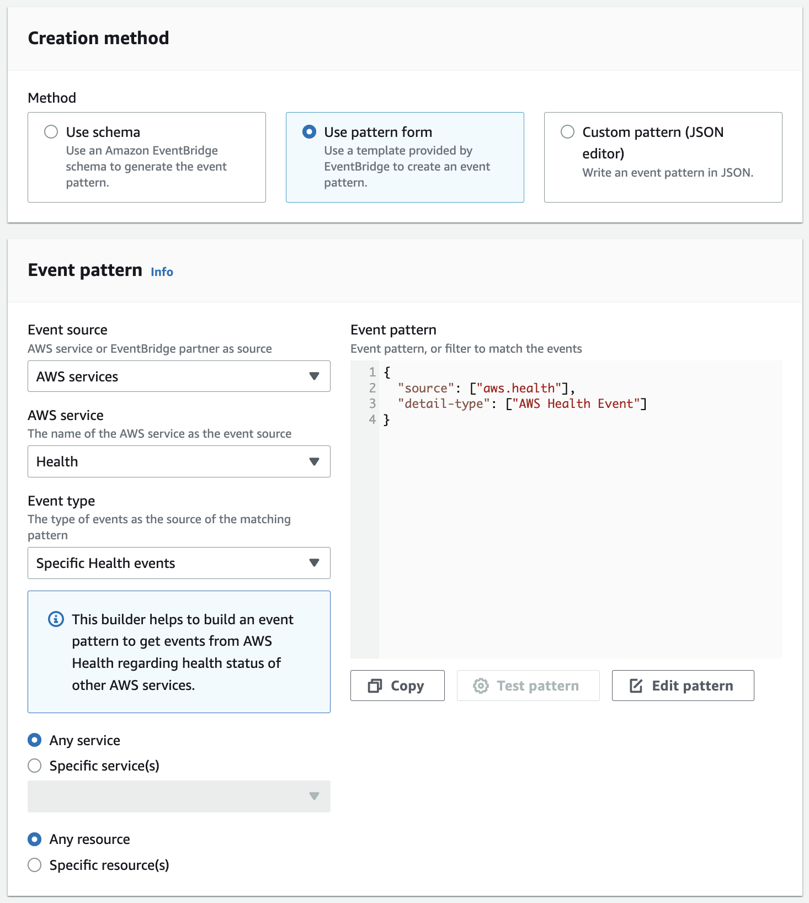

# Week 0 — Billing and Architecture

## In Class

[Class video](https://www.youtube.com/watch?v=SG8blanhAOg&list=PLBfufR7vyJJ7k25byhRXJldB5AiwgNnWv&index=13)

This week was dedicated to getting to know the tools such as AWS console, AWS CLI, Lucid Charts and Gitpod.

To kick off working with AWS, we first set up a separate IAM (**I**dentity and **A**ccess **M**anagement) account to use it with AWS CLI. Using separate IAM accounts is good practice in terms of security because it enables limiting which resources a particular account has access to (Billing, Compute, etc.) and defining what permissions over those resources that account has (Create, Read, Update, Delete). These settings are defined by **policies**, which can be very broad in terms of what they allow like `AdministratorAccess` enabling (you guessed it) admin-like access to almost all of the resources (although it doesn't seem to provide access to billing?), so naturally it is encouraged to use more narrow policies, but for the sake of simplicity we resorted to the former one.

Having created the IAM user and its Access Key (along with the secret key) we proceeded to configuring the Gitpod, which is our way to have a unified dev-environment and is similar to Github's codespaces but provides more generous free-tier.

### Dev env setup

While Console is great for some quick adjustments its still manual work, so the next logical step was to see the ways to automate everything with AWS CLI. There are multiple ways to run it and normally one would simply use their machine for it. Alternatively, AWS recommends using _CloudShell_ which is an in-Browser shell emulator with AWS CLI and other common tools installed and configured.

In our case we had to a bit of setup to get it running in the Gitpod environment, but it was quite easy and what's more important Gitpod supports configuration via `.gitpod.yml` file in which we added the following lines:

```yaml
tasks:
  - name: aws-cli
    env:
      AWS_CLI_AUTO_PROMPT: on-partial
    init: |
      cd /workspace
      curl "https://awscli.amazonaws.com/awscli-exe-linux-x86_64.zip" -o "awscliv2.zip"
      unzip awscliv2.zip
      sudo ./aws/install
      cd $THEIA_WORKSPACE_ROOT
```

This task basically downloads the AWS CLI and installs it in on startup.

Another thing was to set up AWS env variables so that CLI is able to automatically authenticate the user. Here again Gitpod provides `gp env` command to persist those env variables between launches and we did just that:

```bash
gp env AWS_ACCESS_KEY_ID="access key value"
gp env AWS_SECRET_ACCESS_KEY="secret key value"
gp env AWS_DEFAULT_REGION="us-west-2"
```

To ensure the settings are picked up by AWS CLI the following command can be used:

```bash
$ aws sts get-caller-identity
{
    "UserId": "{redacted}",
    "Account": "{redacted}",
    "Arn": "arn:aws:iam::610340716940:user/aws-bootcamp-2023"
}
```

### Bugdets

We started our AWS journey with a quick Billing overview and to control spending (I am no longer elegilble for a free-tier so super important stuff for me) we first manually created a "Monthly Budget" via Console. Budgets are great ways to track spending starting from just the amount in selected currency up to granular quotas per service. Pricing is very involved topic on it's own and we got a very helpful [pricing basics video](https://www.youtube.com/watch?v=OVw3RrlP-sI&list=PLBfufR7vyJJ7k25byhRXJldB5AiwgNnWv&index=14) along with some extra [spedning considerations](https://docs.google.com/document/d/10Hec7Or1ZUedl0ye-05mVPhYFR5-ySh2K8ZbFqTxu1w/edit#) in writing.

Things to note:

- AWS billing estimation is based on **730** hours per months (which is more than 30 days or 720 hours but less than 31 days of 744 hours)

After initial overview we swtiched to CLI and set up a budget along with _CloudWatch_ alert (example can be found [here](https://aws.amazon.com/premiumsupport/knowledge-center/cloudwatch-estimatedcharges-alarm/))

```bash
export $AWS_ACCOUNT_ID = $(aws sts get-caller-identity --query Account --output text)

aws budgets create-budget \
    --account-id $AWS_ACCOUNT_ID \
    --budget file://aws/json/budget.json \
    --notifications-with-subscribers file://aws/json/budget-notifications.json

# create SNS topic for alarm and use its ARN for subscription
export AWS_BUDGET_ALARM_TOPIC_ARN = $(aws sns create-topic --name billing-alarm --query TopicArn)

# subscription needs to be confirmed via link in email
aws sns subscribe \
    --topic-arn=$AWS_BUDGET_ALARM_TOPIC_ARN \
    --protocol=email \
    --notification-endpoint=dezolkin@gmail.com

aws cloudwatch put-metric-alarm --cli-input-json file://aws/json/alarm.json
```

[This video](https://www.youtube.com/watch?v=OdUnNuKylHg&list=PLBfufR7vyJJ7k25byhRXJldB5AiwgNnWv&index=15) basically does everything described above

### Architecture charts

The next step was get familiar with the LucidCharts as our tool of choice to different types of diagramms. The task was to replicate the architectural chart of the main app and here's the result:

https://lucid.app/lucidchart/e8196f1a-c44c-4e56-89c2-3f00724c374e/edit?viewport_loc=-146%2C-88%2C3197%2C1703%2C0_0&invitationId=inv_913fa246-db1d-4ac0-9ff5-3b7567f309a8

## Home Work

### Task: AWS Health Dashboard

> Use EventBridge to hookup Health Dashboard to SNS and send notification when there is a service health issue.

[AWS Health Dashboard is the single place to learn about the availability and operations of AWS services](https://aws.amazon.com/premiumsupport/technology/aws-health-dashboard/)

Basically it is a dashboard showing the state of all AWS services globally. There is also a personalized version of this dashboard showing the services that affect your account and their current state. Looks like this:


_Personal AWS Health Dashboard view_

To accomplish the task I followed [Monitoring AWS Health events with Amazon EventBridge](https://docs.aws.amazon.com/health/latest/ug/cloudwatch-events-health.html) guide.

There is an important consideration:

> Some AWS Health events are not Region-specific. Events that aren't specific to a Region are called global events., These include events sent for AWS Identity and Access Management (IAM). To receive global events, you must create a rule for the US East (N. Virginia) Region.

So I suppose it's improtant to do it in N. Virginia Region

A helpful "Configure" link takes you to a multistep setup flow of an Amazon EventBridge rule:


_First step of EventBridge rule configuration_

Everything event-related is configured on the second step:

- For "Event Source" I picked "AWS events or EventBridge partner events" as suggested in the guide linked above.
  
- Creation method has several options and I went with "Event Pattern" as suggested in the guid, and that provided a meaningful default pattern
  ```json
  {
    "source": ["aws.health"],
    "detail-type": ["AWS Health Event"]
  }
  ```
  Choosing "Any service" and "Any resource" ensures that rule monitors for any AWS Health events, including any new event type codes
  
- "Sample Event" section provides a way to generate example events that the "Creation Method" patterns can be tested against
  

The third step defines the target, which according to the taks is supposed to be an SNS topic (I created one `hw0-aws-health-events-topic` in advance):

_Important consideration is when creating EventBridge rule via console the permissions for targets are configured automatically, whereas when using AWS CLI, SDK, or CloudFormation they are not_

The last step with tags I left empty.

And here's the final result:


To create similar rule via CLI the process takes two steps - create the rule and assign the targets:

```bash
# create rule
aws events put-rule \
    --name "hw0-aws-global-health-events-cli" \
    --event-pattern file://aws/json/aws-all-health-events-pattern.json

# assign targets
aws events put-targets \
    --rule "hw0-aws-global-health-events-cli" \
    --targets=file://aws/json/event-bridge-rule-targets.json
```

The result:


### Task: AWS Well Architected Tool

> Review all the questions of each pillars in the Well Architected Tool (No specialized lens)

Official guide [What is AWS Well-Architected Tool?](https://docs.aws.amazon.com/wellarchitected/latest/userguide/intro.html)

According to the guide "AWS Well-Architected Tool (AWS WA Tool) is a service in the cloud that provides a consistent process for measuring your architecture using AWS best practices".

It is built on top of [AWS Well-Architected Framework](https://docs.aws.amazon.com/wellarchitected/latest/userguide/waf.html) which "documents a set of foundational questions that enable you to understand how a specific architecture aligns with cloud best practices". Those questions are distributed between six pillars:

- operational excellence
- security
- reliability
- performance efficiency
- cost optimization
- and sustainability

Under the framework workload is desinged by applying business decisions to make trade-ofss between those pillars (of course you can't get all of them), e.g. in dev you might choose to reduce the cost at the expense of reliability or performance efficiency.

There are [wellarchitectedlabs](https://www.wellarchitectedlabs.com/) to support learning.

AWS Well-Architected questions overview:

1. [Operational Excellence](https://docs.aws.amazon.com/wellarchitected/latest/operational-excellence-pillar/welcome.html)

   - OPS 1. How do you determine what your priorities are?

     Everyone needs to understand their part in enabling business success. Have shared goals in order to set priorities for resources. This will maximize the benefits of your efforts.

   - OPS 2. How do you structure your organization to support your business outcomes?

     Your teams must understand their part in achieving business outcomes. Teams need to understand their roles in the success of other teams, the role of other teams in their success, and have shared goals. Understanding responsibility, ownership, how decisions are made, and who has authority to make decisions will help focus efforts and maximize the benefits from your teams.

   - OPS 3. How does your organizational culture support your business outcomes?

     Provide support for your team members so that they can be more effective in taking action and supporting your business outcome.

   - OPS 4. How do you design your workload so that you can understand its state?

     Design your workload so that it provides the information necessary across all components (for example, metrics, logs, and traces) for you to understand its internal state. This enables you to provide effective responses when appropriate.

   - OPS 5. How do you reduce defects, ease remediation, and improve flow into production?

     Adopt approaches that improve flow of changes into production, that enable refactoring, fast feedback on quality, and bug fixing. These accelerate beneficial changes entering production, limit issues deployed, and enable rapid identification and remediation of issues introduced through deployment activities.

   - OPS 6. How do you mitigate deployment risks?

     Adopt approaches that provide fast feedback on quality and enable rapid recovery from changes that do not have desired outcomes. Using these practices mitigates the impact of issues introduced through the deployment of changes.

   - OPS 7. How do you know that you are ready to support a workload?

     Evaluate the operational readiness of your workload, processes and procedures, and personnel to understand the operational risks related to your workload.

   - OPS 8. How do you understand the health of your workload?

     Define, capture, and analyze workload metrics to gain visibility to workload events so that you can take appropriate action.

   - OPS 9. How do you understand the health of your operations?

     Define, capture, and analyze operations metrics to gain visibility to operations events so that you can take appropriate action.

   - OPS 10. How do you manage workload and operations events?

     Prepare and validate procedures for responding to events to minimize their disruption to your workload.

   - OPS 11. How do you evolve operations?

     Dedicate time and resources for continuous incremental improvement to evolve the effectiveness and efficiency of your operations.

2. [Security](https://docs.aws.amazon.com/wellarchitected/latest/security-pillar/welcome.html)

   - SEC 1. How do you securely operate your workload?

     To operate your workload securely, you must apply overarching best practices to every area of security. Take requirements and processes that you have defined in operational excellence at an organizational and workload level, and apply them to all areas. Staying up to date with AWS and industry recommendations and threat intelligence helps you evolve your threat model and control objectives. Automating security processes, testing, and validation allow you to scale your security operations.

   - SEC 2. How do you manage identities for people and machines?

     There are two types of identities you need to manage when approaching operating secure AWS workloads. Understanding the type of identity you need to manage and grant access helps you ensure the right identities have access to the right resources under the right conditions. Human Identities: Your administrators, developers, operators, and end users require an identity to access your AWS environments and applications. These are members of your organization, or external users with whom you collaborate, and who interact with your AWS resources via a web browser, client application, or interactive command-line tools. Machine Identities: Your service applications, operational tools, and workloads require an identity to make requests to AWS services - for example, to read data. These identities include machines running in your AWS environment such as Amazon EC2 instances or AWS Lambda functions. You may also manage machine identities for external parties who need access. Additionally, you may also have machines outside of AWS that need access to your AWS environment.

   - SEC 3. How do you manage permissions for people and machines?

     Manage permissions to control access to people and machine identities that require access to AWS and your workload. Permissions control who can access what, and under what conditions.

   - SEC 4. How do you detect and investigate security events?

     Capture and analyze events from logs and metrics to gain visibility. Take action on security events and potential threats to help secure your workload.

   - SEC 5. How do you protect your network resources?

     Any workload that has some form of network connectivity, whether it’s the internet or a private network, requires multiple layers of defense to help protect from external and internal network-based threats.

   - SEC 6. How do you protect your compute resources?

     Compute resources in your workload require multiple layers of defense to help protect from external and internal threats. Compute resources include EC2 instances, containers, AWS Lambda functions, database services, IoT devices, and more.

   - SEC 7. How do you classify your data?

     Classification provides a way to categorize data, based on criticality and sensitivity in order to help you determine appropriate protection and retention controls.

   - SEC 8. How do you protect your data at rest?

     Protect your data at rest by implementing multiple controls, to reduce the risk of unauthorized access or mishandling.

   - SEC 9. How do you protect your data in transit?

     Protect your data in transit by implementing multiple controls to reduce the risk of unauthorized access or loss.

   - SEC 10. How do you anticipate, respond to, and recover from incidents?

     Preparation is critical to timely and effective investigation, response to, and recovery from security incidents to help minimize disruption to your organization.

3. [Reliability](https://docs.aws.amazon.com/wellarchitected/latest/reliability-pillar/welcome.html)

   - REL 1. How do you manage service quotas and constraints?

     For cloud-based workload architectures, there are service quotas (which are also referred to as service limits). These quotas exist to prevent accidentally provisioning more resources than you need and to limit request rates on API operations so as to protect services from abuse. There are also resource constraints, for example, the rate that you can push bits down a fiber-optic cable, or the amount of storage on a physical disk.

   - REL 2. How do you plan your network topology?

     Workloads often exist in multiple environments. These include multiple cloud environments (both publicly accessible and private) and possibly your existing data center infrastructure. Plans must include network considerations such as intra- and inter-system connectivity, public IP address management, private IP address management, and domain name resolution.

   - REL 3. How do you design your workload service architecture?

     Build highly scalable and reliable workloads using a service-oriented architecture (SOA) or a microservices architecture. Service-oriented architecture (SOA) is the practice of making software components reusable via service interfaces. Microservices architecture goes further to make components smaller and simpler.

   - REL 4. How do you design interactions in a distributed system to prevent failures?

     Distributed systems rely on communications networks to interconnect components, such as servers or services. Your workload must operate reliably despite data loss or latency in these networks. Components of the distributed system must operate in a way that does not negatively impact other components or the workload. These best practices prevent failures and improve mean time between failures (MTBF).

   - REL 5. How do you design interactions in a distributed system to mitigate or withstand failures?

     Distributed systems rely on communications networks to interconnect components (such as servers or services). Your workload must operate reliably despite data loss or latency over these networks. Components of the distributed system must operate in a way that does not negatively impact other components or the workload. These best practices enable workloads to withstand stresses or failures, more quickly recover from them, and mitigate the impact of such impairments. The result is improved mean time to recovery (MTTR).

   - REL 6. How do you monitor workload resources?

     Logs and metrics are powerful tools to gain insight into the health of your workload. You can configure your workload to monitor logs and metrics and send notifications when thresholds are crossed or significant events occur. Monitoring enables your workload to recognize when low-performance thresholds are crossed or failures occur, so it can recover automatically in response.

   - REL 7. How do you design your workload to adapt to changes in demand?

     A scalable workload provides elasticity to add or remove resources automatically so that they closely match the current demand at any given point in time.

   - REL 8. How do you implement change?

     Controlled changes are necessary to deploy new functionality, and to ensure that the workloads and the operating environment are running known software and can be patched or replaced in a predictable manner. If these changes are uncontrolled, then it makes it difficult to predict the effect of these changes, or to address issues that arise because of them.

   - REL 9. How do you back up data?

     Back up data, applications, and configuration to meet your requirements for recovery time objectives (RTO) and recovery point objectives (RPO).

   - REL 10. How do you use fault isolation to protect your workload?

     Fault isolated boundaries limit the effect of a failure within a workload to a limited number of components. Components outside of the boundary are unaffected by the failure. Using multiple fault isolated boundaries, you can limit the impact on your workload.

   - REL 11. How do you design your workload to withstand component failures?

     Workloads with a requirement for high availability and low mean time to recovery (MTTR) must be architected for resiliency.

   - REL 12. How do you test reliability?

     After you have designed your workload to be resilient to the stresses of production, testing is the only way to ensure that it will operate as designed, and deliver the resiliency you expect.

   - REL 13. How do you plan for disaster recovery (DR)?

     Having backups and redundant workload components in place is the start of your DR strategy. RTO and RPO are your objectives for restoration of your workload. Set these based on business needs. Implement a strategy to meet these objectives, considering locations and function of workload resources and data. The probability of disruption and cost of recovery are also key factors that help to inform the business value of providing disaster recovery for a workload.

4. [Performance Efficiency](https://docs.aws.amazon.com/wellarchitected/latest/performance-efficiency-pillar/welcome.html)

   - PERF 1. How do you select the best performing architecture?

     Often, multiple approaches are required for optimal performance across a workload. Well-architected systems use multiple solutions and features to improve performance.

   - PERF 2. How do you select your compute solution?

     The optimal compute solution for a workload varies based on application design, usage patterns, and configuration settings. Architectures can use different compute solutions for various components and enable different features to improve performance. Selecting the wrong compute solution for an architecture can lead to lower performance efficiency.

   - PERF 3. How do you select your storage solution?

     The optimal storage solution for a system varies based on the kind of access method (block, file, or object), patterns of access (random or sequential), required throughput, frequency of access (online, offline, archival), frequency of update (WORM, dynamic), and availability and durability constraints. Well-architected systems use multiple storage solutions and enable different features to improve performance and use resources efficiently.

   - PERF 4. How do you select your database solution?

     The optimal database solution for a system varies based on requirements for availability, consistency, partition tolerance, latency, durability, scalability, and query capability. Many systems use different database solutions for various subsystems and enable different features to improve performance. Selecting the wrong database solution and features for a system can lead to lower performance efficiency.

   - PERF 5. How do you configure your networking solution?

     The optimal network solution for a workload varies based on latency, throughput requirements, jitter, and bandwidth. Physical constraints, such as user or on-premises resources, determine location options. These constraints can be offset with edge locations or resource placement.

   - PERF 6. How do you evolve your workload to take advantage of new releases?

     When architecting workloads, there are finite options that you can choose from. However, over time, new technologies and approaches become available that could improve the performance of your workload.

   - PERF 7. How do you monitor your resources to ensure they are performing?

     System performance can degrade over time. Monitor system performance to identify degradation and remediate internal or external factors, such as the operating system or application load.

   - PERF 8. How do you use tradeoffs to improve performance?

     When architecting solutions, determining tradeoffs enables you to select an optimal approach. Often you can improve performance by trading consistency, durability, and space for time and latency.

5. [Cost Optimization](https://docs.aws.amazon.com/wellarchitected/latest/cost-optimization-pillar/welcome.html)

   - COST 1. How do you implement cloud financial management?

     Implementing Cloud Financial Management enables organizations to realize business value and financial success as they optimize their cost and usage and scale on AWS.

   - COST 2. How do you govern usage?

     Establish policies and mechanisms to ensure that appropriate costs are incurred while objectives are achieved. By employing a checks-and-balances approach, you can innovate without overspending.

   - COST 3. How do you monitor usage and cost?

     Establish policies and procedures to monitor and appropriately allocate your costs. This allows you to measure and improve the cost efficiency of this workload.

   - COST 4. How do you decommission resources?

     Implement change control and resource management from project inception to end-of-life. This ensures you shut down or terminate unused resources to reduce waste.

   - COST 5. How do you evaluate cost when you select services?

     Amazon EC2, Amazon EBS, and Amazon S3 are building-block AWS services. Managed services, such as Amazon RDS and Amazon DynamoDB, are higher level, or application level, AWS services. By selecting the appropriate building blocks and managed services, you can optimize this workload for cost. For example, using managed services, you can reduce or remove much of your administrative and operational overhead, freeing you to work on applications and business-related activities.

   - COST 6. How do you meet cost targets when you select resource type, size and number?

     Ensure that you choose the appropriate resource size and number of resources for the task at hand. You minimize waste by selecting the most cost effective type, size, and number.

   - COST 7. How do you use pricing models to reduce cost?

     Use the pricing model that is most appropriate for your resources to minimize expense.

   - COST 8. How do you plan for data transfer charges?

     Ensure that you plan and monitor data transfer charges so that you can make architectural decisions to minimize costs. A small yet effective architectural change can drastically reduce your operational costs over time.

   - COST 9. How do you manage demand, and supply resources?

     For a workload that has balanced spend and performance, ensure that everything you pay for is used and avoid significantly underutilizing instances. A skewed utilization metric in either direction has an adverse impact on your organization, in either operational costs (degraded performance due to over-utilization), or wasted AWS expenditures (due to over-provisioning).

   - COST 10. How do you evaluate new services?

     As AWS releases new services and features, it's a best practice to review your existing architectural decisions to ensure they continue to be the most cost effective.

6. [Sustainability](https://docs.aws.amazon.com/wellarchitected/latest/sustainability-pillar/sustainability-pillar.html)

   - SUS 1. How do you select Regions to support your sustainability goals?

     Choose Regions where you will implement your workloads based on both your business requirements and sustainability goals.

   - SUS 2. How do you take advantage of user behavior patterns to support your sustainability goals?

     The way users consume your workloads and other resources can help you identify improvements to meet sustainability goals. Scale infrastructure to continually match user load and ensure that only the minimum resources required to support users are deployed. Align service levels to customer needs. Position resources to limit the network required for users to consume them. Remove existing, unused assets. Identify created assets that are unused and stop generating them. Provide your team members with devices that support their needs with minimized sustainability impact.

   - SUS 3. How do you take advantage of software and architecture patterns to support your sustainability goals?

     Implement patterns for performing load smoothing and maintaining consistent high utilization of deployed resources to minimize the resources consumed. Components might become idle from lack of use because of changes in user behavior over time. Revise patterns and architecture to consolidate under-utilized components to increase overall utilization. Retire components that are no longer required. Understand the performance of your workload components, and optimize the components that consume the most resources. Be aware of the devices your customers use to access your services, and implement patterns to minimize the need for device upgrades.

   - SUS 4. How do you take advantage of data access and usage patterns to support your sustainability goals?

     Implement data management practices to reduce the provisioned storage required to support your workload, and the resources required to use it. Understand your data, and use storage technologies and configurations that best support the business value of the data and how it’s used. Lifecycle data to more efficient, less performant storage when requirements decrease, and delete data that’s no longer required.

   - SUS 5. How do your hardware management and usage practices support your sustainability goals?

     Look for opportunities to reduce workload sustainability impacts by making changes to your hardware management practices. Minimize the amount of hardware needed to provision and deploy, and select the most efficient hardware for your individual workload.

   - SUS 6. How do your development and deployment processes support your sustainability goals?

     Look for opportunities to reduce your sustainability impact by making changes to your development, test, and deployment practices

## Task: CI/CD logic pipeline diagramm

> Create an architectural diagram (to the best of your ability) the CI/CD logical pipeline in Lucid Charts


_To the best of my ability_
