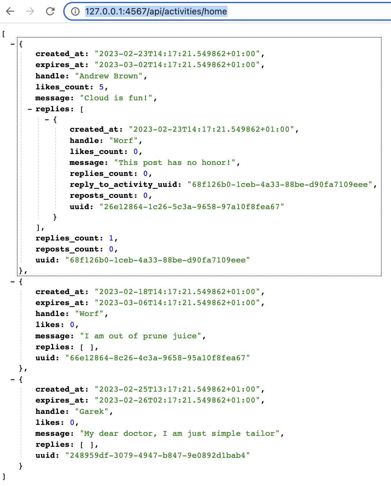

# Week 1 — App Containerization

## In Class

### Considerations when asking for help

[Video](https://www.youtube.com/watch?v=tDPqmwKMP7Y&list=PLBfufR7vyJJ7k25byhRXJldB5AiwgNnWv&index=30)

To be mindful of everyone's time and to make sure you've given some time and thought to overcome the problem on your own, when asking for help give:

- the context of an error (what the problem is, what actions caused it, what was the outcome of the actions)
- screenshots, if given, should be precise and provide as much of info as needed, not more no less
- if possible/applicable share your research/assumptions on the issue
- when sharing the code do it with the appropriate formatting and highilghting, also try to reduce the amount of code and try to pinpoint the exact place you think has the problem in it. If unsure also provide a link to the whole file/repo
- make sure to check the devtools console, network tab for any failing requests, for memory/perf related cases it's beninficial to run some profiling. Share those findings

### Grading Homework Summaries

[Video](https://www.youtube.com/watch?v=FKAScachFgk&list=PLBfufR7vyJJ7k25byhRXJldB5AiwgNnWv&index=26)

Good:

- consice
- has details - names of tools, services, costs, etc.
- challenges and mistakes
- when describing required checklist item, details of how it was accomplished instead of simply copying the result description

Bad:

- simply repeating the checklist description
- no summary at all or just a link to journal
- too big (more than a paragraph, 2 tops)
- too much unrelated info

### Containerize Application (Dockerfiles, Docker Compose)

[Video](https://www.youtube.com/watch?v=zJnNe5Nv4tE&list=PLBfufR7vyJJ7k25byhRXJldB5AiwgNnWv&index=23)

Containers provide reproducibility, portability, isolation, simplification and seed up of development and testing and predictability when deploying to prod.

Instead of building the software yourself on your machine (or on different machines if you need it) you can rely on a huge number of public images built and tested by the community.

https://www.linuxserver.io is a group that maintains lots of different images.

The images are usually hosted on container-registries and one of the most popular ones is [Dockerhub](https://hub.docker.com/). There are a number of other registries that could be used.
Also there is an OCI (Open Container Initiative) which standardizes how the images, registries are built, etc. and Dockerhub follows the OCI standard.

The images are **_pushed_** into the registry, from where the consumers **_pull_** them.

Containers will be relying on several ENV variables, several of which will differ depending on wether they are run in gitpod or locally.

Same for all envs

```bash
export BACKEND_PORT=4567
export FRONTEND_PORT=3000
env | grep _PORT
BACKEND_PORT=4567
FRONTEND_PORT=3000
```

Host dependent:

- gitpod

  ```bash
  export BACKEND_URL=$(gp url $BACKEND_PORT)
  export FRONTEND_URL=$(gp url $FRONTEND_PORT)
  ```

  Remember to also open respective ports in Gitpod UI

- localhost
  ```bash
  export BACKEND_URL="http://localhost:$BACKEND_PORT"
  export FRONTEND_URL="http://localhost:$FRONTEND_PORT"
  env | grep _URL
  BACKEND_URL=http://localhost:4567
  FRONTEND_URL=http://localhost:3000
  ```

A Dockerfile (no extension is due to unknown historic reasons) defines the container:

```dockerfile
# backend-flask/Dockerfile
FROM python:3.10-slim-buster

# Inside Container
WORKDIR /backend-flask

# Outside -> Inside
COPY requirements.txt requirements.txt

# Inside
RUN pip3 install -r requirements.txt

# Outside -> Inside
COPY . .

# Inside
ENV FLASK_ENV=development
# required env vars
ENV PORT $BACKEND_PORT
ENV FRONTEND_URL $FRONTEND_URL
ENV BACKEND_URL $BACKEND_URL

# Inside -> Outside
EXPOSE ${PORT}

CMD [ "python3", "-m" , "flask", "run", "--host=0.0.0.0", "--port=${PORT}"]
```

Instructions are pretty much self-explanatory but just in case:

- `FROM <image-name>` - describes the base image for the container. There are _slim_ versions with most of the unused stuff stripped off and normal versions that might include extra stuff like `curl`, etc. In the example [`python:3.10-slim-buster` base image](https://github.com/docker-library/python/blob/a3533b1c48d968e784516470d18f3c24975df3d8/3.10/slim-buster/Dockerfile) is used (which uses [`debian:buster-slim` underneath](https://github.com/debuerreotype/docker-debian-artifacts/blob/48072f1bd234114bb51470bba31a4e4a0040a2a4/buster/slim/Dockerfile) which in trun is based off `scratch`). To see what is really installed in container one would need to go all the way down through to the root container

> `scratch` is an official "empty" image and can be even found [here](https://hub.docker.com/_/scratch). According to the description: "`FROM scratch` is a no-op in the Dockerfile, and will not create an extra layer in your image".

- `WORKDIR` - sets the directory from which the application will work from when the container starts. That directory is within the Container and **not** connected to any directory of the Host OS. 

- `COPY` - copies particular files (or all of them with `COPY . .`) from the current directory on Host OS to the working directory in Container

- `RUN` - runs a command within the container

- `ENV` - sets an environment variable

- `EXPOSE` -

- `CMD` - is used to run the application. The arguments should be provided as an array of strings, so the following bash command to [run backend locally](../backend-flask/README.md#L44):
  ```bash
  python3 -m flask run --host=0.0.0.0 --port=4567
  ```
  would translate into `["python3", "-m" , "flask", "run", "--host=0.0.0.0", "--port=4567"]`

> `RUN` vs `CMD`. `RUN` is used to create a **layer**, eg. install something into the container. `CMD` is the command that will run when the container starts and it doesn't create a layer

When running backend opening http://127.0.0.1:4567/api/activities/home should show something like this:


Command to build a container:

```bash
docker build -t backend-flask ./backend-flask
```

`-t` flag allows to _tag_ the container as "backend-flask". Here is the [list of options](https://docs.docker.com/engine/reference/commandline/build/#options) for `docker-build` command

The output:

```bash
[+] Building 19.8s (10/10) FINISHED
 => [internal] load build definition from Dockerfile                                                                                                    0.0s
 => => transferring dockerfile: 299B                                                                                                                    0.0s
 => [internal] load .dockerignore                                                                                                                       0.0s
 => => transferring context: 2B                                                                                                                         0.0s
 => [internal] load metadata for docker.io/library/python:3.10-slim-buster                                                                              2.3s
 => [1/5] FROM docker.io/library/python:3.10-slim-buster@sha256:c059afb019e7aea99777e54b3e0ff8c970ef552b737fb4acbd842916c751fcfd                       14.0s
 => => resolve docker.io/library/python:3.10-slim-buster@sha256:c059afb019e7aea99777e54b3e0ff8c970ef552b737fb4acbd842916c751fcfd                        0.0s
 => => sha256:480491d492bf4f7b85f80f2960c57b17d95072796565b24aca989c18f87b616c 1.37kB / 1.37kB                                                          0.0s
 => => sha256:a6fa18359efaaef75d59ddbd159f01a117cd5f1d1867c4f87692508ef7bb89a9 7.81kB / 7.81kB                                                          0.0s
 => => sha256:ebcd4e3db076a77234a526ba23bdac8b205f7d74fd052a936cfa190b42cf49aa 25.92MB / 25.92MB                                                       12.4s
 => => sha256:5a182a3139fcfa13084ea46c489a237f9597b907ce61fc900f52877d5ea3bf2a 2.65MB / 2.65MB                                                          6.4s
 => => sha256:2edfb9062ae604b4d0c27f539f4a05e159a8d3964960b323742cf7585cc05a01 11.52MB / 11.52MB                                                        5.9s
 => => sha256:c059afb019e7aea99777e54b3e0ff8c970ef552b737fb4acbd842916c751fcfd 988B / 988B                                                              0.0s
 => => sha256:43024b8b8e96bc481f2ec78fbee17b754fdbe9568917bb3d634729d85a6b8e65 233B / 233B                                                              6.3s
 => => sha256:bb14e0ecae2a10dcc1d4846a1f92b6d52f9c0b44392a2a94402e904fd5d3a2bb 3.35MB / 3.35MB                                                          8.5s
 => => extracting sha256:ebcd4e3db076a77234a526ba23bdac8b205f7d74fd052a936cfa190b42cf49aa                                                               0.8s
 => => extracting sha256:5a182a3139fcfa13084ea46c489a237f9597b907ce61fc900f52877d5ea3bf2a                                                               0.1s
 => => extracting sha256:2edfb9062ae604b4d0c27f539f4a05e159a8d3964960b323742cf7585cc05a01                                                               0.3s
 => => extracting sha256:43024b8b8e96bc481f2ec78fbee17b754fdbe9568917bb3d634729d85a6b8e65                                                               0.0s
 => => extracting sha256:bb14e0ecae2a10dcc1d4846a1f92b6d52f9c0b44392a2a94402e904fd5d3a2bb                                                               0.1s
 => [internal] load build context                                                                                                                       0.0s
 => => transferring context: 34.03kB                                                                                                                    0.0s
 => [2/5] WORKDIR /backend-flask                                                                                                                        0.2s
 => [3/5] COPY requirements.txt requirements.txt                                                                                                        0.1s
 => [4/5] RUN pip3 install -r requirements.txt                                                                                                          3.0s
 => [5/5] COPY . .                                                                                                                                      0.0s
 => exporting to image                                                                                                                                  0.1s
 => => exporting layers                                                                                                                                 0.1s
 => => writing image sha256:2f8c0d2fb6b7b00e10e87ed0528254071662e17015fabbec20a3c4152abc1cda                                                            0.0s
 => => naming to docker.io/library/backend-flask
```

To run it:

```bash
$ docker run --rm -p $BACKEND_PORT:$BACKEND_PORT -it -e FRONTEND_URL -e BACKEND_URL -e BACKEND_PORT backend-flask
```

`-d` can be used to run in "detached" mode

To debug a running container one could

- either use "Attach shell" in VS Code 
- or connect via bash:

  ```bash
  $ docker ps # to list all running containers
  CONTAINER ID   IMAGE           COMMAND                  CREATED         STATUS         PORTS                    NAMES
  c743fc4bf21c   backend-flask   "python3 -m flask ru…"   4 minutes ago   Up 4 minutes   0.0.0.0:4567->4567/tcp   condescending_khayyam

  $ docker exec -it c743fc4bf21c bash # execute shell on the container
  ```

To list all images:

```bash
$ docker images
REPOSITORY            TAG         IMAGE ID       CREATED         SIZE
backend-flask         latest      2f8c0d2fb6b7   9 minutes ago   123MB
postgres              11-alpine   6c94b629b5a6   2 months ago    233MB
mysql                 8.0         7b6f3978ca29   2 months ago    550MB
postgres              latest      d5ddcf88c3f7   4 months ago    355MB
concourse/concourse   latest      e7b500e07f7e   7 months ago    1.85GB
rdclda/concourse      7.8.2       cdf0d56a697d   7 months ago    723MB
```

> While virtualization provides true isolation and independent resources managed by Hypervisor, containerization achieves similar goals by sharing the Host OS resources via the Container Daemon: 

Containerizing frontend:

```dockerfile
# frontend-react-js/Dockerfile
FROM node:16.18

#required env vars
ENV PORT $FRONTEND_PORT
ENV REACT_APP_BACKEND_URL $BACKEND_URL

COPY . /frontend-react-js
WORKDIR /frontend-react-js
RUN npm install
EXPOSE ${PORT}
CMD ["npm", "start"]
```

Build Container:

```bash
docker build -t frontend-react-js ./frontend-react-js
```

Run Container:

```bash
docker run --rm -it -p $FRONTEND_PORT:$FRONTEND_PORT -e BACKEND_URL -e FRONTEND_PORT frontend-react-js
```

After adapting `docker-compose.yaml` to run locally, it's alive:


Nice explanations about ENV vars: https://www.youtube.com/watch?v=vOoCFxlQIbE&t=1s
